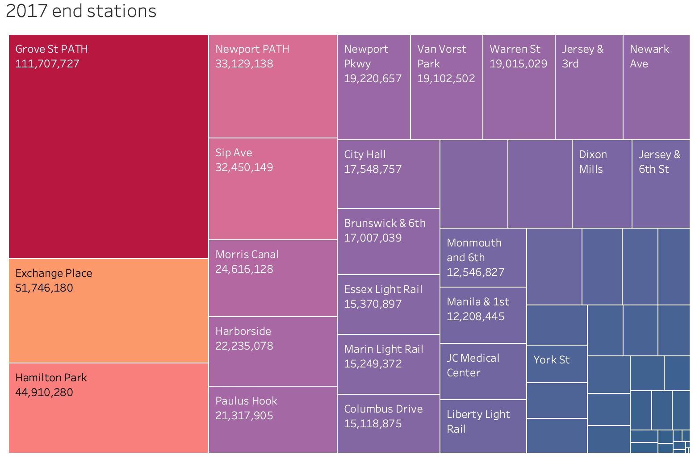
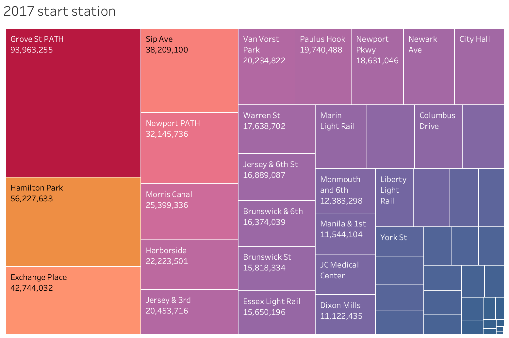
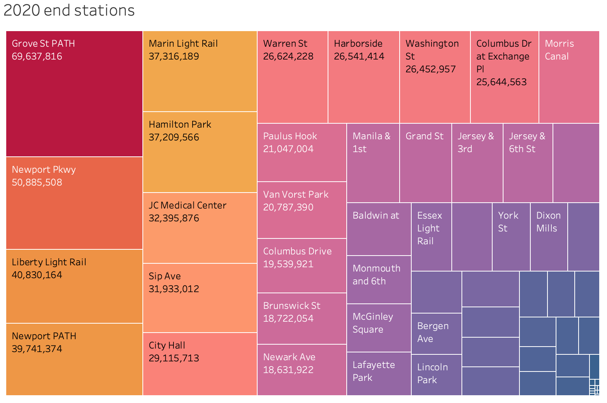
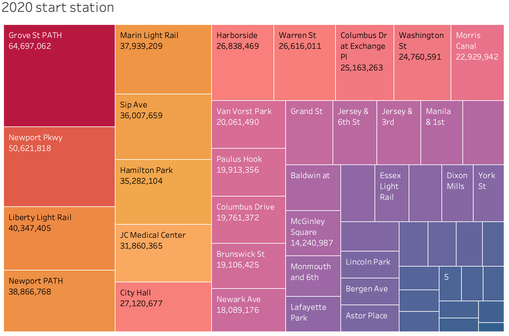
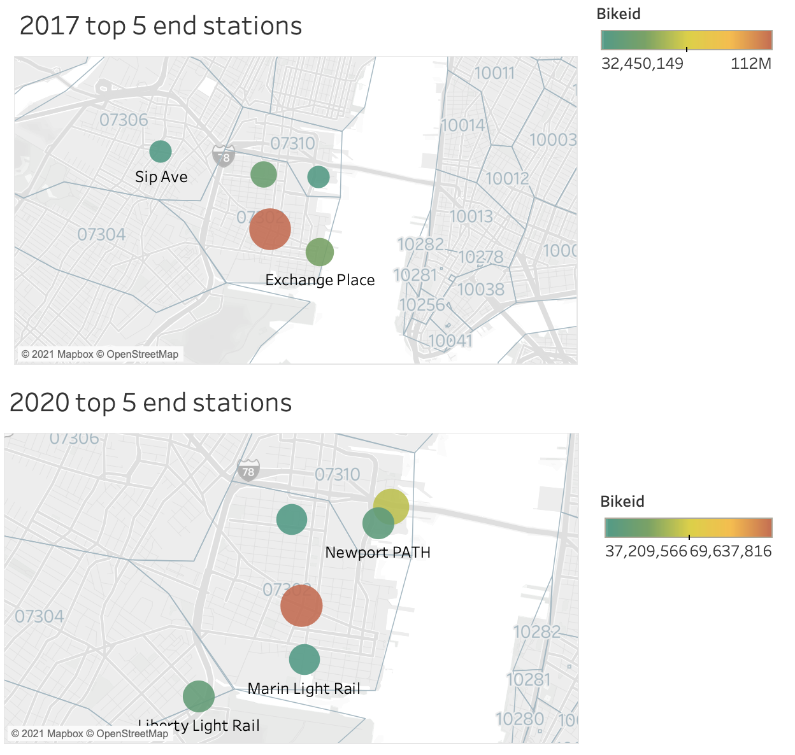
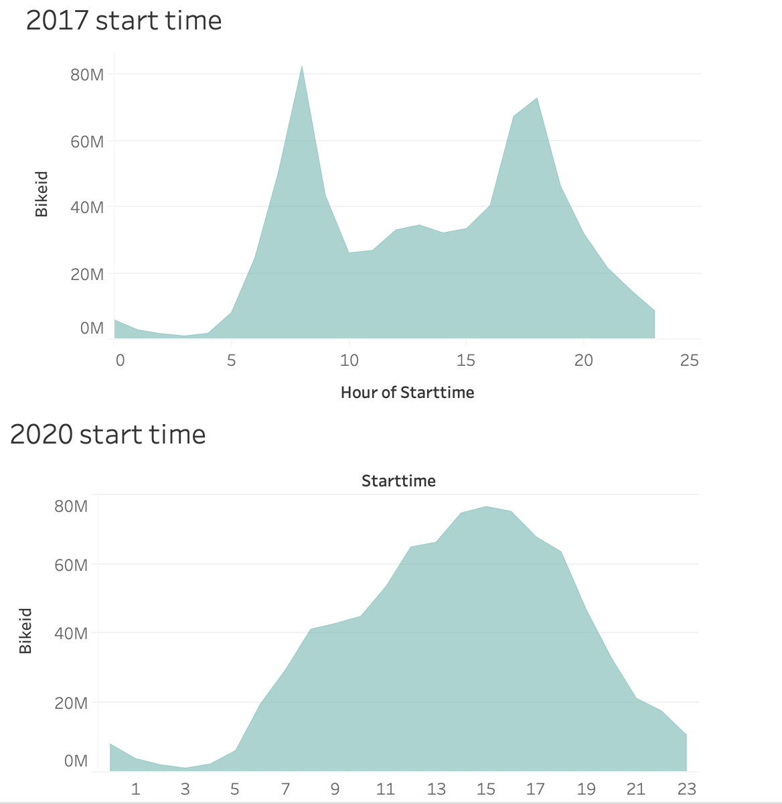
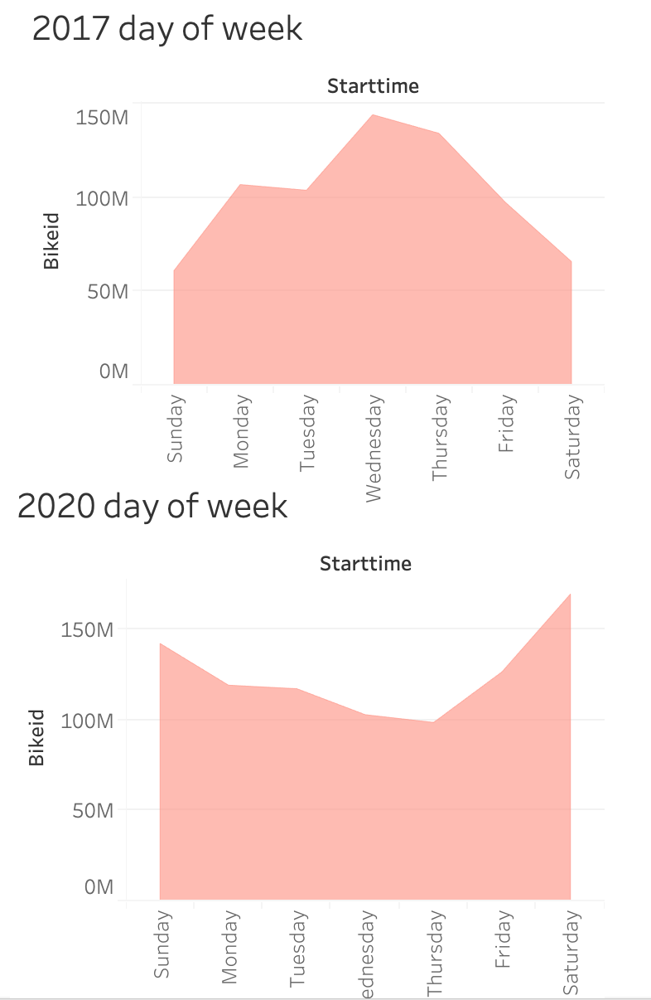
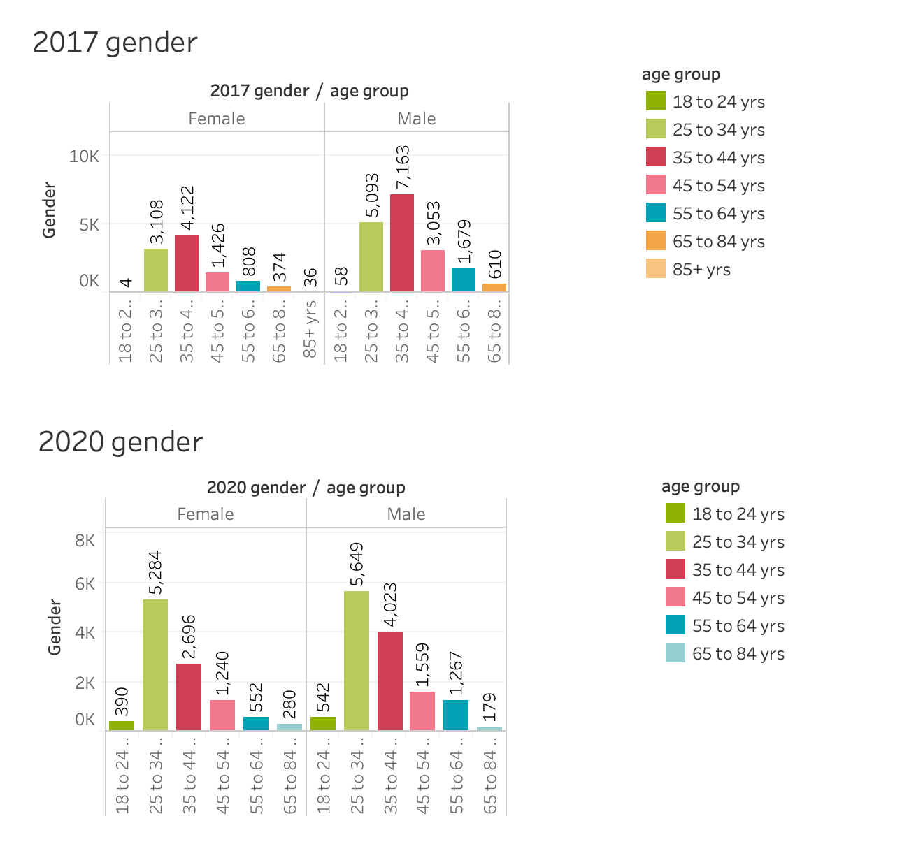
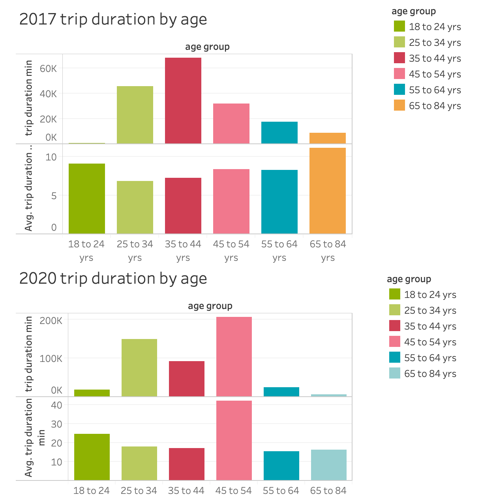
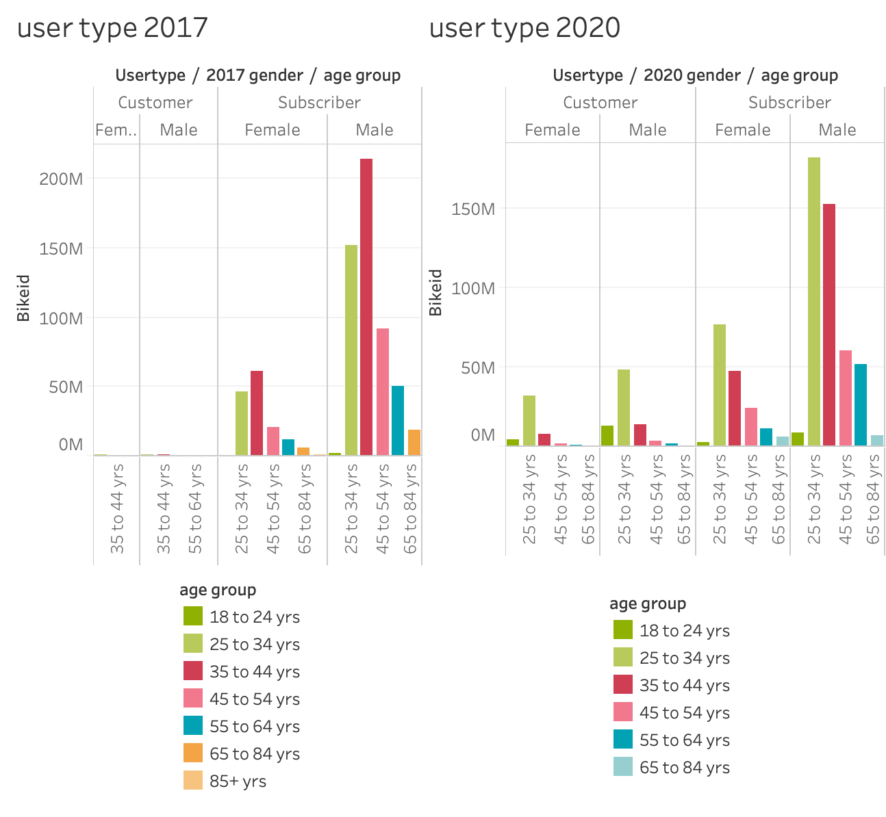

# Tableau-challenge
citibike tableau homework

## Data

Monthly CSV files (Nov 2017- Nov 2020) were collected from  [Citi Bike Data](https://www.citibikenyc.com/system-data) webpage.

## Visualizations

https://public.tableau.com/views/citibike-challenge_16104730514360/CitiBikeNov20172020?:language=en&:display_count=y&publish=yes&:origin=viz_share_link

(Images/top_bottom_ten_stations.png)

## Analysis

### 1. 2017/2020 Station Use
In 2017 Grove Street station was the major destination point in Jersey City.   While Grove Street is still a major point or access in 2020 the station use has spread out and other stations are being used more frequently.

### 2. Top End Stations Distance
The top 5 end stations maps depict the distance between each end station.   In 2017 the Sip Ave was a top location but dropped down to 8th in 2020.  It appears the bikes are being used as a mode of transpotation to larger commuter hubs.  

### 3. Trip Start time 2017/2020
The start of ride time in 2017 shows peaks that coincide with the start end end of the work day.   The 2020 hours appear to be influenced by the pandemic and the shift to working at home with the peak ride start time being from late morning to early evening.

### 4. Day of Week Ride
In 2017 the ridership was the greatest during the week days, while in 2020 the ridership shifted to weekend use.  The shift is most likely due to the pandemic and people no longer commuting to work.

### 5. Gender/Age Composition
From the launch in 2017 to 2020 the female ridership increase greatly.  The greatest increase in the female is in the 25-34 age group.   The greatest decrease is seen in the male 35-44 age group.

### 6. Gender Distro Map
The 2 maps show at a glance where female ridership increased from 2017 to 2020.  The female ridership remained stron at the frequently used stations and increase at some of the smaller stations that are further from the transit hubs in Jersey City.

### 7. Avg. Trip Duration by group
The average trip duration increased from 15 mins to over 40 min from 2017 to 2020.   

### 8. User Type
The CitiBike users in 2017 when the service was first infroduced were mainly subscribers.  As the years went on the ridership base remained mostly subscribers; although the use of bikes in 2020 by non subscribers increaed creatly in the 25-34 age range.

